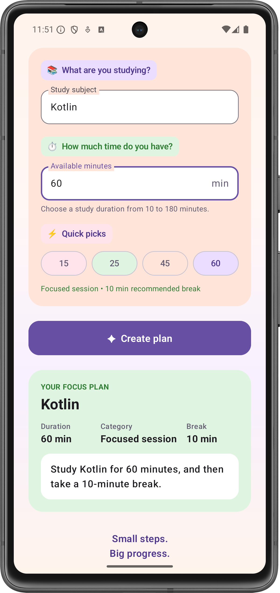

# Focus Plan Builder

**Name:** Ankita Patra  
**Course:** CS501 E1  
**Assignment:** Individual Coding Assignment 2 — Focus Plan Builder  
**Package:** `com.ankitapatra.focusplanbuilder`

---

## Table of Contents

1. [Overview](#overview)
2. [Features](#features)
3. [Screenshot](#screenshot)
4. [Running the App](#running-the-app)
5. [How the App Works](#how-the-app-works)
6. [State and Recomposition](#state-and-recomposition)
7. [Validation and Testing](#validation-and-testing)
8. [Visual Design](#visual-design)
9. [AI Use](#ai-use)

---

## Overview

Focus Plan Builder is a single-screen Android application built with Kotlin,
Jetpack Compose, and Material 3. It helps a user create a simple study plan
based on the subject they want to study and the amount of time they have
available.

The user enters a subject and a duration between 10 and 180 minutes. The app
validates the inputs automatically and enables the **Create plan** button only
when both inputs are valid.

After a plan is created, the app displays:

- the cleaned study subject
- the study duration
- the duration category
- the recommended break time
- a complete study-plan summary

The duration is categorized as **Quick review**, **Focused session**, or
**Extended session**, with a corresponding recommended break.

The application uses a fully declarative Jetpack Compose interface without
XML layouts, Fragments, or legacy Android Views.
---

---

## Features

### Assignment Requirements

- Single-screen Android application built with Kotlin and Jetpack Compose.
- Material 3 components used throughout the interface.
- Subject input validated using `isNotBlank()`.
- Duration entered as text and safely parsed using `toIntOrNull()`.
- Valid study duration restricted to **10–180 minutes**.
- **Create plan** button enabled only when both inputs are valid.
- `durationCategory(minutes)` classifies the study session as:
    - **Quick review:** 10–29 minutes
    - **Focused session:** 30–60 minutes
    - **Extended session:** 61–180 minutes
- `recommendedBreak(minutes)` recommends a **5, 10, or 15 minute** break.
- `FocusPlan` data class stores the subject, duration, category, and break duration.
- Generated result displays the subject, duration, category, recommended break, and a complete study-plan summary.
- Editing either input after creating a plan immediately removes the previous result.
- `rememberSaveable` preserves the subject and duration inputs during configuration changes such as screen rotation.
- Layout uses Compose `Column`, `Row`, `Spacer`, and `Card` components.

### Additional UI Features

- Quick-pick buttons for **15, 25, 45, and 60 minutes**.
- Live preview of the duration category and recommended break.
- Validation feedback when the duration is invalid.
- Scrollable interface that works in portrait and landscape orientations.
- Custom purple, peach, green, and pink Material 3 color palette.
- Soft gradient application background.
- Rounded input, action, and result cards.
- Footer message: **“Small steps. Big progress.”**

---

## Screenshot

### Generated Focus Plan



The screenshot shows a valid plan for **Kotlin** with a **60-minute**
duration. The application categorizes it as a **Focused session** and
recommends a **10-minute break**.

---

## Running the App

### Requirements

- Android Studio
- Android SDK 24 or higher
- Kotlin and Jetpack Compose support
- Android emulator or physical Android device

### Steps

1. Clone the repository.
2. Open the `Focus_Plan_Builder` project in Android Studio.
3. Allow Gradle to sync and download the required dependencies.
4. Start an Android emulator or connect an Android device.
5. Select the `app` run configuration.
6. Click **Run ▶**.
7. Enter a study subject.
8. Enter a duration between **10 and 180 minutes**.
9. Click **Create plan** to generate the study plan.

---

## How the App Works

The application separates state management from presentation.

`FocusPlanRoute` owns the subject, duration text, generated plan, validation,
and plan-creation logic. `FocusPlanScreen` receives the current values and
callbacks and is responsible for displaying the interface.

The duration begins as text because it comes directly from an editable text
field. It is converted safely when needed:

```kotlin
val minutes: Int? = minutesText.toIntOrNull()

The enabled state of the **Create plan** button is derived directly from the
current inputs:

```kotlin
val canCreatePlan =
    subject.isNotBlank() &&
        minutes != null &&
        minutes in 10..180
```

When the user selects **Create plan**, the application creates a `FocusPlan`
using the trimmed subject, validated duration, calculated duration category,
and recommended break.

### Duration Rules

| Duration | Category | Recommended Break |
|---|---|---|
| 10–29 minutes | Quick review | 5 minutes |
| 30–60 minutes | Focused session | 10 minutes |
| 61–180 minutes | Extended session | 15 minutes |

Editing either the subject or duration after a plan has been created clears
the previous result so that the displayed plan always corresponds to the
current input.

---

## State and Recomposition

`FocusPlanRoute` owns the application state, including `subject`,
`minutesText`, and the generated `plan`. It also performs validation and
creates the `FocusPlan`. `FocusPlanScreen` is responsible for presenting the
UI and sends user actions back to the route through callbacks. This keeps
state management separate from presentation.

The text-field values are stored as `String` because text input can
temporarily contain values that cannot be represented as an `Int`, such as
an empty field or `abc`. For calculations, `minutesText` is converted using
`toIntOrNull()`. This is safer than `toInt()` because invalid input returns
`null` rather than throwing an exception and crashing the application.

`canCreatePlan` is derived from the current subject and duration instead of
being stored as separate mutable state. When either input changes, Compose
observes the state change and recomposes the affected UI. Validation is
recalculated automatically, so the **Create plan** button immediately becomes
enabled or disabled.

`rememberSaveable` is used for `subject` and `minutesText`, allowing these
values to survive Activity recreation such as screen rotation. The generated
plan itself uses `remember`, while editing either input clears the old plan
by setting it to `null`.

---

## Validation and Testing

The application was manually tested using the required assignment test cases.

| Subject | Duration | Expected Result |
|---|---:|---|
| Blank | 25 | Create plan disabled |
| Kotlin | Blank | Create plan disabled |
| Kotlin | abc | Create plan disabled; no crash |
| Kotlin | 9 | Create plan disabled |
| Kotlin | 10 | Quick review; 5-minute break |
| Kotlin | 29 | Quick review; 5-minute break |
| Kotlin | 30 | Focused session; 10-minute break |
| Kotlin | 60 | Focused session; 10-minute break |
| Kotlin | 61 | Extended session; 15-minute break |
| Kotlin | 180 | Extended session; 15-minute break |
| Kotlin | 181 | Create plan disabled |

Additional manual checks were performed to verify that:

- Erasing the duration does not crash the application.
- Subject and duration inputs survive screen rotation.
- Editing either input after creating a plan removes the previous result.
- The **Create plan** button updates automatically when input validity changes.
- A whitespace-only subject is treated as blank.

---

## Visual Design

The application uses a custom Material 3 interface with purple as the primary
color and soft peach, pink, and green accent colors. A subtle vertical
gradient is used for the screen background.

The input area uses a warm peach card, while the generated focus plan uses a
green result card to clearly distinguish the output from the input section.
The quick-pick duration buttons use pastel colors, while the primary
**Create plan** action uses purple.

Rounded cards, spacing, centered headings, and the
**“Small steps. Big progress.”** footer were added to make the single-screen
interface clear and visually organized.

---

## AI Use

Generative AI (ChatGPT by OpenAI) was used to assist with identifying an
appropriate Compose structure, suggestions,and  reviewing the required test cases, and organizing the
README documentation. AI-generated suggestions that were retained were
reviewed, implemented, and manually tested. The final application behavior
and assignment requirements were verified against the implemented code.